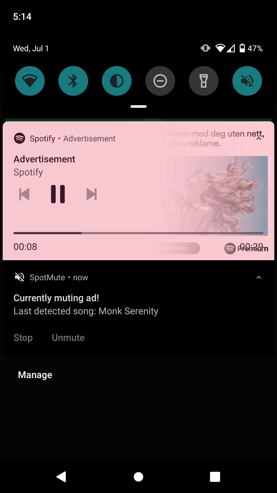

# SpotMute - Mute Spotify ads

https://play.google.com/store/apps/details?id=com.developments.samu.muteforspotify

### Documentation

SpotMute is a *permission free* app that can mute Spotify ads. It does this by
reading Spotify's media notifications, and naively figuring out when an
ad is supposed to play.

Spotify documentation: https://developer.spotify.com/documentation/android/guides/android-media-notifications/

All muting logic is done in [LoggerService.](app/src/main/java/com/developments/samu/muteforspotify/service/LoggerService.kt)

 


Spotify media intent:

| Intent extra     | Type    | Description                         |
| ---------------- | ------- | ----------------------------------- |
| id               | String  | A Spotify URI for the track         |
| artist           | String  | The track artist                    |
| album            | String  | The album name                      |
| track            | String  | The track name                      |
| length           | Integer | Length of the track, in seconds     |
| playing          | Boolean | True if playing, false if paused    |
| playbackPosition | Integer | The current playback position in ms |
| timeSent         | Long    | Time broadcast posted in ms         |


Basic concept:

* Have a broadcast receiver listen and read intents
* Find playback time left: length - playbackPosition
* Mute volume at that time
* If a new song starts playing (and new intent received); unmute
* If no new song is detected; an ad is playing. Unmute when next song is detected


Note that media notifications (Device Broadcast Status) need to be enabled manually in the Spotify app.


### Dependencies
Thanks to contributing projects! 
* <a href="https://github.com/doubledotlabs/doki">doubledotlabs/doki</a>
* <a href="https://github.com/urbandroid-team/dont-kill-my-app">urbandroid-team/dont-kill-my-app</a>


### License
```
MIT License

Copyright (c) 2020 samu.developments

Permission is hereby granted, free of charge, to any person obtaining a copy
of this software and associated documentation files (the "Software"), to deal
in the Software without restriction, including without limitation the rights
to use, copy, modify, merge, publish, distribute, sublicense, and/or sell
copies of the Software, and to permit persons to whom the Software is
furnished to do so, subject to the following conditions:

The above copyright notice and this permission notice shall be included in all
copies or substantial portions of the Software.

THE SOFTWARE IS PROVIDED "AS IS", WITHOUT WARRANTY OF ANY KIND, EXPRESS OR
IMPLIED, INCLUDING BUT NOT LIMITED TO THE WARRANTIES OF MERCHANTABILITY,
FITNESS FOR A PARTICULAR PURPOSE AND NONINFRINGEMENT. IN NO EVENT SHALL THE
AUTHORS OR COPYRIGHT HOLDERS BE LIABLE FOR ANY CLAIM, DAMAGES OR OTHER
LIABILITY, WHETHER IN AN ACTION OF CONTRACT, TORT OR OTHERWISE, ARISING FROM,
OUT OF OR IN CONNECTION WITH THE SOFTWARE OR THE USE OR OTHER DEALINGS IN THE
SOFTWARE.
```
